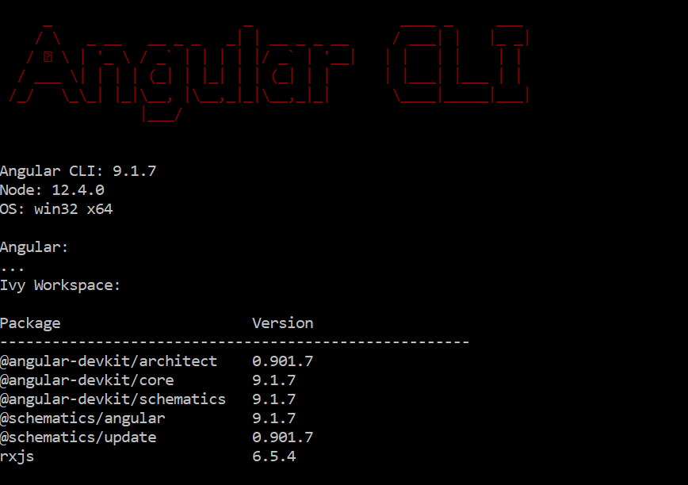
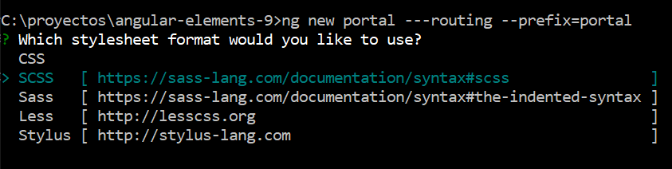
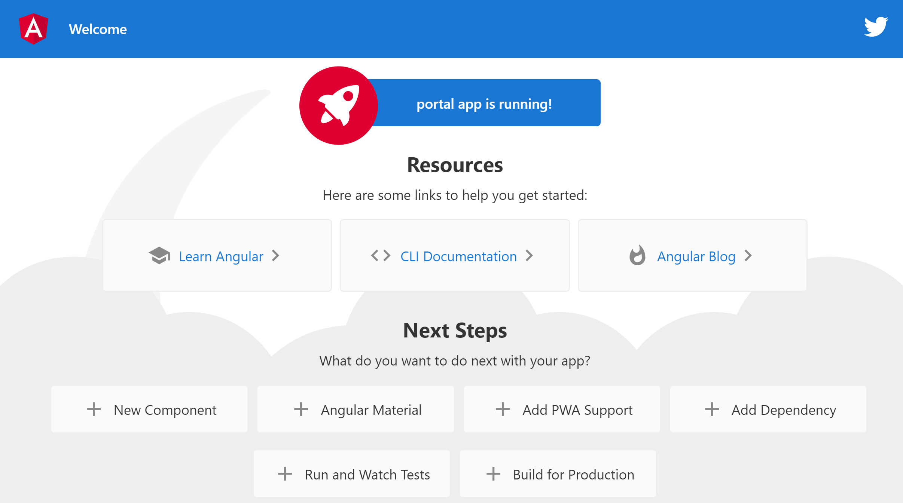

# Artículo Angular Elements Completo

¿Qué es Angular Elements?

```html
Angular elements are Angular components packaged as custom elements, a web standard for defining new HTML elements in a framework-agnostic way
```

Resumiendo, es para crear componentes reutilizables aplicando Shadow Dom. Aunque hoy en día, también se utiliza para conseguir proyectos aislados para importar en otros proyectos. Algo desaconsejado por la documentación, pero una alternativa para no utilizar iframes.

En estos proyectos vamos a analizar todas las casuísticas posibles con Angular Elements, partiendo de la versión de Angular 9.

Tendremos diferentes proyectos, aunque partiremos siempre del proyecto portal, que será el proyecto principal.

Antes de entrar a trabajar con Angular Elements, es aconsejable que leais un poco de documentación de que son los webcomponents.

## Versiones



## Pasos que vamos a realizar

### Generar estructura proyecto

```js
mkdir angular-elements-9
cd angular-elements-9
```

Inicializamos el git

```js
git init
```

Creamos nuestra aplicación de angular y elegimos sass => scss

```js
ng new portal ---routing --prefix=portal
```



Nos metemos dentro del proyecto

```js
cd portal
```

Instalamos las dependencias, con npm o yarn

```js
yarn install
// o
npm install
```

Probamos que la aplicación funciona correctamente

```js
npm run start
```

Abrimos el navegador, y ponemos la ruta que nos indica la terminal: [http://localhost:4200/](http://localhost:4200/)

Podemos ver la aplicación de angular ejecutada.



### Añadimos la dependencia de Angular Elements

```js
ng add @angular/elements
```

Esto nos añadirá algunas modificaciones en el proyecto, además de la dependencia en el package.json

```js
"@angular/elements": "^9.1.9",
```

## Portal

Toda la documentación del portal y pasos realizados para su generación, están en [su propio readme](https://github.com/jesuscuesta/angular-elements/tree/master/portal).

## Generamos SPA-ONE

Generamos la aplicación spa-one

```js
ng new spa-one --routing --prefix=spa-one
```

La documentación de dicha aplicación, y como generarla, está en su [propio readme](https://github.com/jesuscuesta/angular-elements/tree/feat/spa-one/spa-one).

## Generamos SPA-With-Routing

Generamos la aplicación spa-with-routing

```js
ng new spa-with-routing --routing --prefix=spa-with-routing
```

La documentación de dicha aplicación, y como generarla, está en su [propio readme](https://github.com/jesuscuesta/angular-elements/tree/master/spa-with-routing).

## Generamos SPA-Input

Generamos la aplicación spa-input

```js
ng new spa-input --routing --prefix=spa-input
```

La documentación de dicha aplicación, y como generarla, está en su [propio readme](https://github.com/jesuscuesta/angular-elements/tree/master/spa-input).

## Documentación

- https://angular.io/guide/elements: Documentación oficial de Angular para los Angular Elements. Bastante mala la documentación, no os resolverá ninguna duda.

- https://www.angulararchitects.io/aktuelles/your-options-for-building-angular-elements/
  