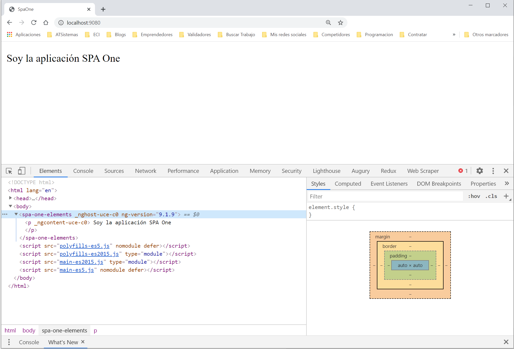
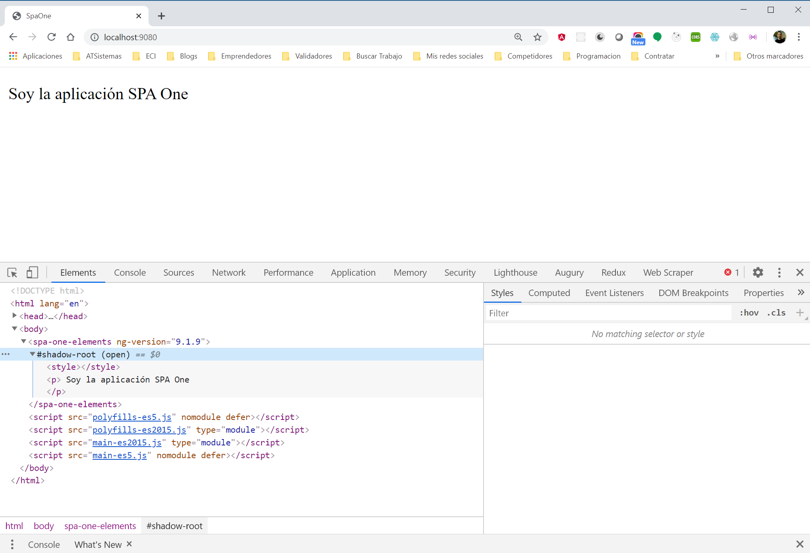

# Spa With Routing

Aplicación convertida en angular Elements con secciones

## Pasos

### Añadimos la dependencia de Angular Elements

```js
ng add @angular/elements
```

Esto nos añadirá algunas modificaciones en el proyecto, además de la dependencia en el package.json

```js
"@angular/elements": "^9.1.9",
```

### Instalamos librería para compilar

Instalamos la librería que utilizaremos para compilar el proyecto en Angular Elements. La instalaremos en formato general, pero también podríamos instalarla en uno de los subproyectos.

```js
ng add ngx-build-plus
```

Actualizamos app.module.ts, para registrar nuestro componente como un custom element. Además eliminaremos el componente de la propiedad Bootstrap, dado que lo ejecturemos a través del ngDoBoostrap.

```js
import { BrowserModule } from '@angular/platform-browser';
import { NgModule, Injector } from '@angular/core';
import { createCustomElement } from '@angular/elements';
import { AppRoutingModule } from './app-routing.module';
import { AppComponent } from './app.component';

@NgModule({
  declarations: [
    AppComponent
  ],
  imports: [
    BrowserModule,
    AppRoutingModule
  ],
  providers: [],
  bootstrap: []
})
export class AppModule {
  constructor(private injector: Injector) {
  const el = createCustomElement(AppComponent, { injector });
  customElements.define('spa-one-elements', el);
}

  ngDoBootstrap() {}
}
```

Actualizamos el package.json, para generar el build. Con este comando conseguiremos tener solo un build, además de quitar los hash de los bundldes.

```js
"build:ele": "ng build --prod --output-hashing none --single-bundle true",
```

Una vez generado, nos vamos con la terminal a la carpeta ./dist/spa-one y actualizamos el contenido para añadir el custom-element, en lugar del app-root

```js
<!DOCTYPE html>
<html lang="en">
  <head>
    <meta charset="utf-8" />
    <title>SpaOne</title>
    <base href="/" />
    <meta name="viewport" content="width=device-width, initial-scale=1" />
    <link rel="icon" type="image/x-icon" href="favicon.ico" />
  </head>
  <body>
    <spa-with-routing-elements></spa-with-routing-elements>
    <script src="polyfills-es5.js" nomodule defer></script>
    <script src="polyfills-es2015.js" type="module"></script>
    <script src="main-es2015.js" type="module"></script>
    <script src="main-es5.js" nomodule defer></script>
  </body>
</html>
```

Luego, en la terminal, levantamos un servidor temporal, para comprobar su visualización. Luego abrimos nuestro navegador en la ruta ```http://localhost:9080/```.

```npx static-server```



En el caso de que quisiésemos un webcomponent, deberíamos añadir una propiedad al app.component.ts para añadirle el shadown.

```js
import { Component, ViewEncapsulation } from '@angular/core';

@Component({
  selector: 'spa-with-routing-root',
  templateUrl: './app.component.html',
  styleUrls: ['./app.component.scss'],
  encapsulation: ViewEncapsulation.ShadowDom
})
export class AppComponent {
  title = 'spa with routing';
}
```

Como podemos ver en la captura de pantalla, si vamos al depurador, veremos que ahora tenemos #shadow-root.


### Crear routing

Generaremos dos componentes.

```js
ng g component pages/home
```

```js
ng g component pages/contact
```

Creamos un menú en el app.component.html

```html
Esto es una SPA básica con routing sin lazy loading
<ul>
  <li><a routerLink="home">home</a></li>
  <li><a routerLink=contact">contact</a></li>
</ul>

<router-outlet></router-outlet>

```

Actualizamos el routing
```js
import { NgModule } from '@angular/core';
import { Routes, RouterModule } from '@angular/router';
import { HomeComponent } from './pages/home/home.component';
import { ContactComponent } from './pages/contact/contact.component';

const routes: Routes = [
  { path: 'home', component: HomeComponent },
  { path: 'contact', component: ContactComponent },
];

@NgModule({
  imports: [RouterModule.forRoot(routes)],
  exports: [RouterModule],
})
export class AppRoutingModule {}

```
